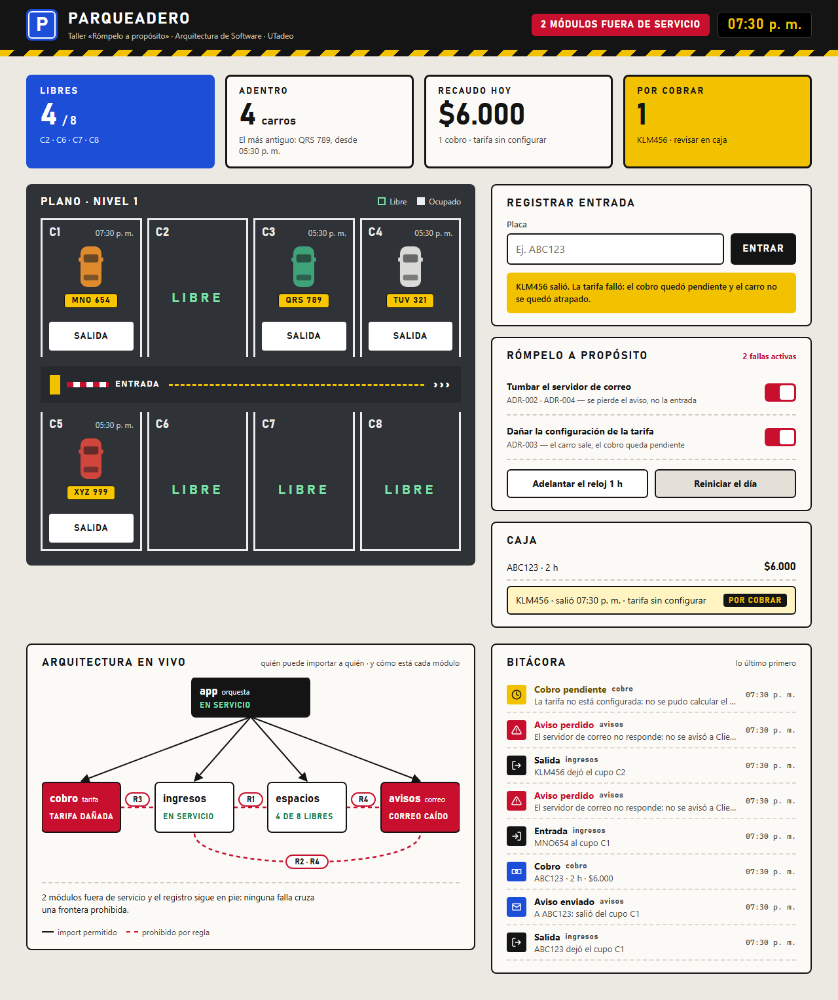
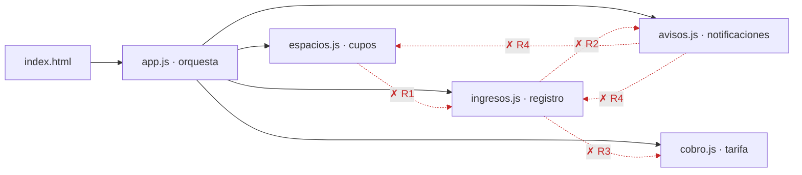

# Parqueadero · Rómpelo a propósito

Taller del 2º corte · Arquitectura de Software · UTadeo. Un parqueadero web mínimo —cinco
módulos ES6, sin frameworks, sin npm, sin build— cuyas fronteras están escritas en ADR y
**se hacen cumplir solas** en cada push.

## Cómo abrirlo

Chrome y Edge bloquean los módulos ES6 cuando la página se abre con doble clic (`file://`); si
pasa, la página lo dice en pantalla. Ábranla con un servidor, desde la raíz del repo:

```
python -m http.server 8000      # y luego http://localhost:8000
```

o con *Live Server* de VS Code.

La página tiene dos interruptores para **romperla a propósito**: tumbar el correo y dañar la
tarifa. El carro entra y sale igual; lo que falló queda en la bitácora, y el mapa de la
arquitectura muestra qué módulo se cayó y cuál sigue en pie.

## Cómo se ve



*Con el correo caído y la tarifa dañada, `avisos` y `cobro` quedan fuera de servicio e `ingresos`
sigue registrando: ninguna falla cruza una frontera prohibida.*

## Quién puede importar a quién



Las flechas continuas son los únicos imports que existen: **solo `app` conoce a los demás**.
Las rojas punteadas son las que prohíben las reglas. Además, `ingresos` **anuncia** cada entrada
y salida (patrón Observer) y `app` conecta a `avisos` como oyente: `ingresos` no sabe quién
escucha, y si el oyente falla, el registro ya quedó hecho.

## Las reglas

| Regla | ADR | La frontera | Qué protege | Responsable |
|---|---|---|---|---|
| R1 | [ADR-001](arquitectura/adr/ADR-001.md) | `espacios` no importa `ingresos` | El libro de entradas y salidas tiene un solo autor | Jesús |
| R2 | [ADR-002](arquitectura/adr/ADR-002.md) | `ingresos` no importa `avisos` | Si el correo se cae, la entrada y la salida no se caen | Santiago |
| R3 | [ADR-003](arquitectura/adr/ADR-003.md) | `ingresos` no importa `cobro` | Una tarifa mal configurada no deja un carro atrapado en la caseta | Julián |
| R4 | [ADR-004](arquitectura/adr/ADR-004.md) | `avisos` no importa `espacios` ni `ingresos` | Un aviso solo cuenta lo que pasó, nunca lo cambia | Sergio |

El `porque` completo de cada regla está en [`arquitectura/reglas.json`](arquitectura/reglas.json),
y es lo que imprime el pipeline cuando alguien la viola. Drivers y reparto del equipo:
[`arquitectura/drivers.md`](arquitectura/drivers.md).

## Cómo se verifica

| Qué | Comando | Dónde corre |
|---|---|---|
| Las fronteras: quién importa a quién | `node tools/verificar.js` | workflow **Verificar arquitectura** (el que se califica) |
| Los drivers, cuando algo falla de verdad | `node --test` | workflow **Calidad** |
| Que cada regla todavía pueda ponerse roja | `node tools/probar-reglas.js` | workflow **Calidad** |

Solo hace falta Node. Cada comando sale 0 si todo está bien y 1 si no.

## La prueba: verde, rojo, verde

1. **Sistema sano** → verde.
2. **Rojo a propósito:** un import prohibido por cada ADR → rojo, con el `porque` de cada regla.
   Las pruebas seguían en verde: el código funcionaba, la arquitectura no. Eso solo lo ve el
   verificador.
3. **Verde otra vez:** se quitan esos imports → verde.

Está en la pestaña **Actions**, workflow *Verificar arquitectura*. Una regla que nunca se violó a
propósito no se sabe si funciona; por eso `probar-reglas.js` además las viola todas en cada push,
en una copia del código.

## Lo que el verificador no ve

`tools/verificar.js` es del kit del taller y no se toca. Sus límites, dichos en voz alta:

- Solo lee imports de la forma `from '...'`. Un `import('./avisos.js')` dinámico, o un
  `import './avisos.js'` sin `from`, pasan sin ser vistos.
- Compara por substring: prohibir `cobro` prohíbe cualquier ruta que contenga «cobro».
  `probar-reglas.js` avisa si eso atrapa a otro módulo.
- Lee también los comentarios: un `from './avisos.js'` escrito en un comentario de `ingresos`
  cuenta como violación.
- Ve qué módulo se importa, no qué función se llama: no distingue leer de escribir. Por eso R4
  prohíbe el módulo entero (ver la alternativa descartada de [ADR-004](arquitectura/adr/ADR-004.md)).

Por eso existen las pruebas de comportamiento además de las reglas.

## Qué hay aquí

- `index.html` y `src/` — el sistema. `app` orquesta; `espacios`, `ingresos`, `cobro` y
  `avisos` no se conocen entre sí. Son cinco módulos y no cuatro porque ADR-003 sacó el cobro
  de `ingresos`.
- `arquitectura/` — drivers, ADR y `reglas.json`.
- `tools/verificar.js` — el verificador del kit. **No se toca.**
- `tools/probar-reglas.js` — la prueba por mutación de las reglas.
- `tests/` — los drivers, probados por comportamiento.
- `.github/workflows/` — `pipeline.yml` (Verificar arquitectura) y `calidad.yml` (Calidad).
